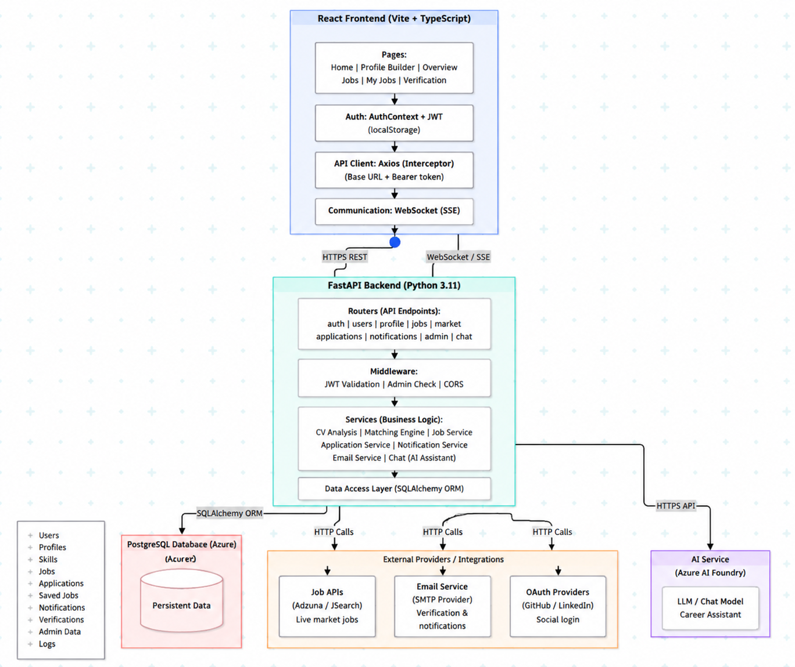
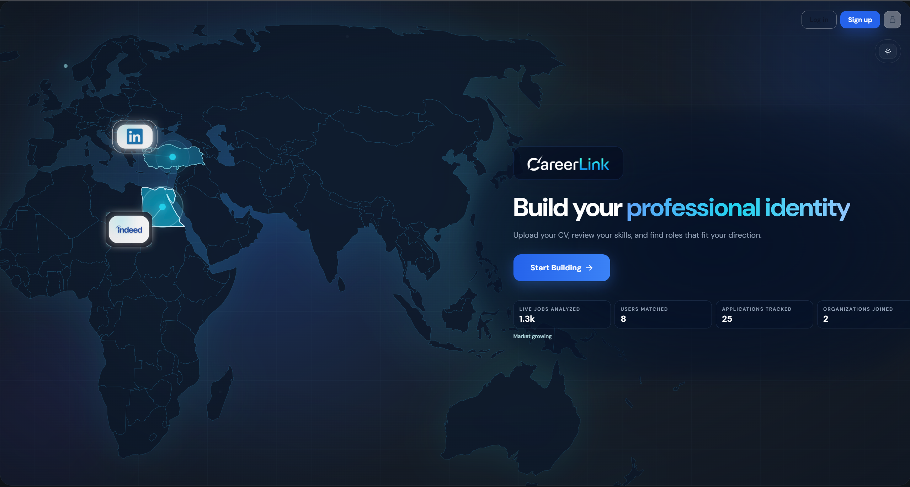
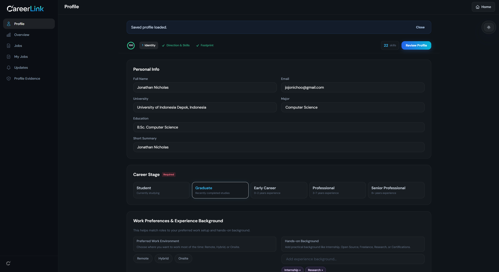
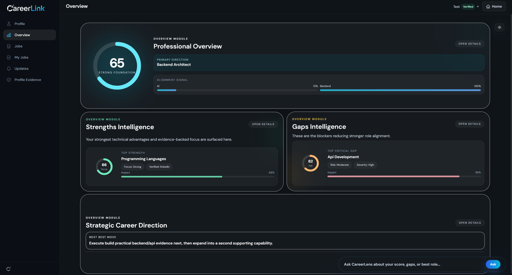
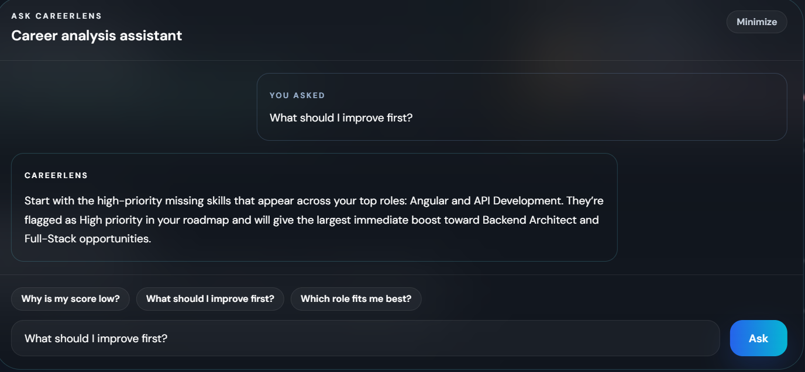
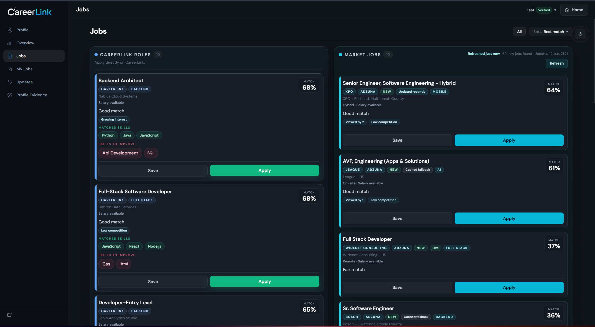
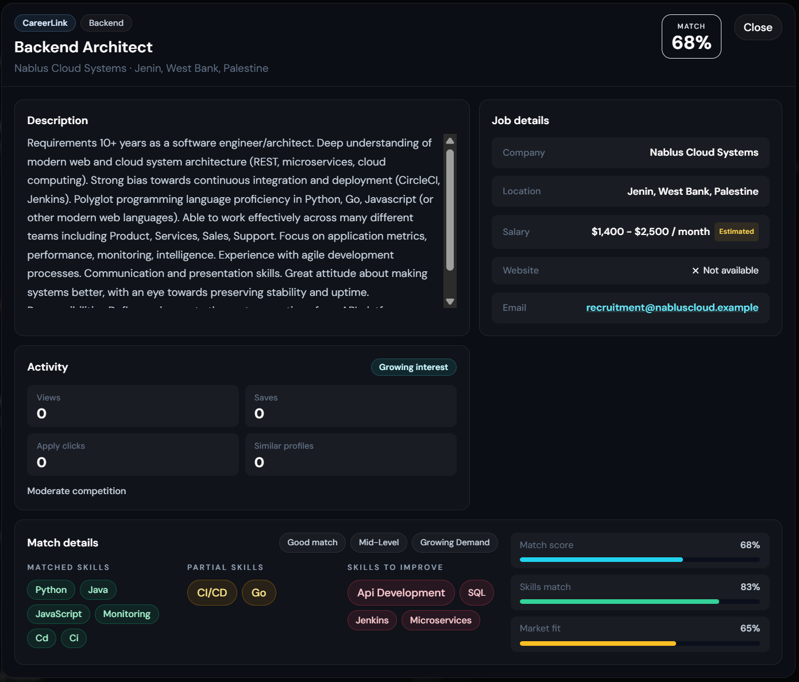
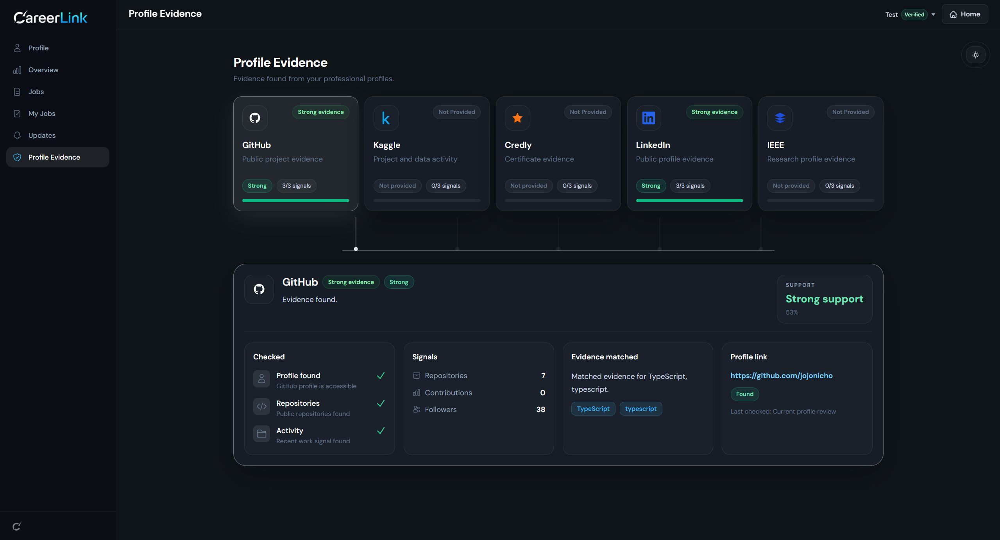
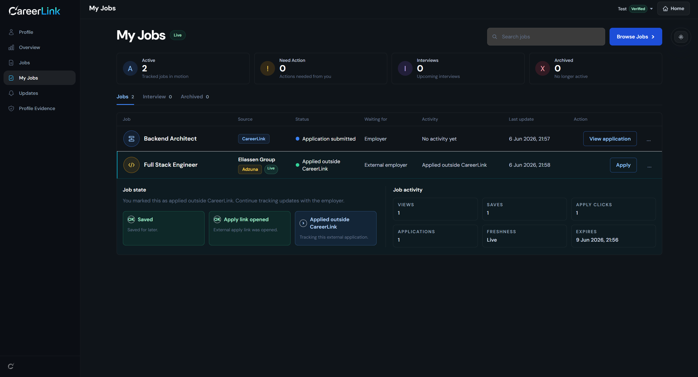
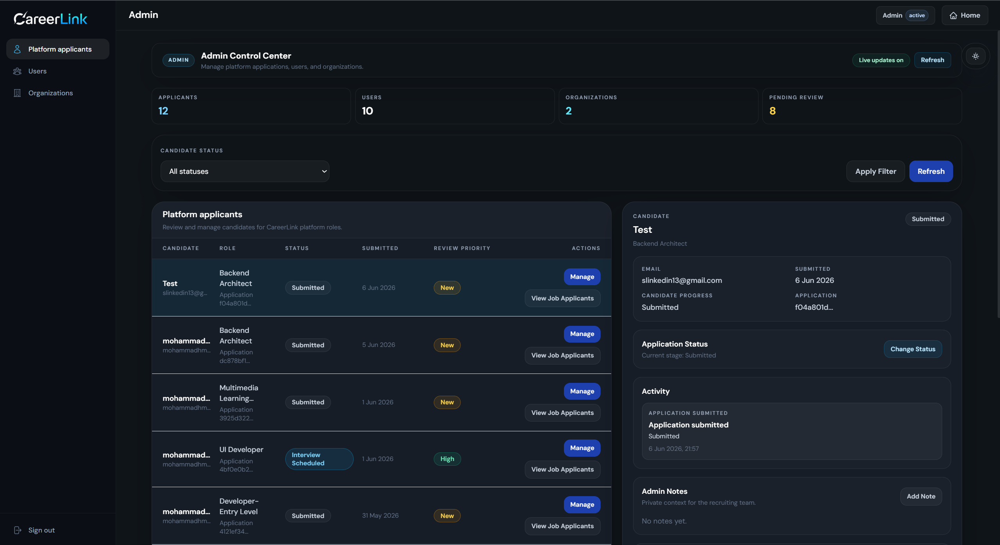

# CareerLink

**Smart AI-powered Career Analysis & Job Matching Platform**

CareerLink is a full-stack career analysis and job matching platform that helps users understand their career readiness, identify skill gaps, and discover suitable job opportunities based on their CV or manually entered profile information.

> This is a public showcase repository. The original source code is kept private.

---

## Live Demo

**Website:** https://carearlink.tech

**API Health Check:** https://carearlink.tech/health

---

## Tech Stack


| Layer             | Technologies                                                       |
| ----------------- | ------------------------------------------------------------------ |
| Frontend          | React, TypeScript, Vite, Tailwind CSS, React Router, Axios         |
| Backend           | Python, FastAPI, SQLAlchemy, Pydantic, Uvicorn                     |
| Database          | PostgreSQL, Azure Database for PostgreSQL                          |
| AI / Matching     | PyMuPDF, Sentence Transformers, all-MiniLM-L6-v2                   |
| External Services | Adzuna API, SMTP Email Service, Azure AI Foundry                   |
| Deployment        | GitHub Actions, Azure App Service, Azure PostgreSQL, Custom Domain |

---

## Project Overview

CareerLink was built to simulate a real-world career platform that does more than display job listings.

The system analyzes the user profile, extracts and normalizes skills, compares the profile with job requirements, calculates match scores, detects missing skills, and provides structured recommendations.

The platform supports two main job sources:

* **Internal Platform Roles:** curated roles managed inside CareerLink.
* **External Market Jobs:** live jobs retrieved from external market APIs.

CareerLink also includes authentication, email verification, job tracking, notifications, recruiter/admin workflows, and an AI career assistant chatbot.

---

## Why This Project Matters

Many job seekers can upload a CV or browse jobs, but they often do not understand:

* which jobs actually match their skills,
* which skills are missing,
* why a job is recommended,
* and what they should learn next.

CareerLink addresses this gap by making career matching more explainable, structured, and personalized.

---

## Key Features

* CV upload and analysis
* Manual profile builder
* PDF text extraction using PyMuPDF
* Skill extraction and normalization
* Semantic job matching using Sentence Transformers
* Match percentage and score breakdown
* Matched, partial, and missing skills detection
* Internal platform roles
* External market job discovery
* Saved jobs and application tracking
* Email verification workflow
* JWT-based authentication
* Notifications system
* Admin / recruiter dashboard
* AI career assistant chatbot
* Full-stack deployment on Azure

---

## System Architecture



CareerLink follows a layered full-stack architecture:

```text
User
↓
React Frontend
↓
FastAPI Backend
↓
Business Services
↓
PostgreSQL Database
↓
External Services
```

The frontend communicates with the backend using REST APIs and authenticated requests. The backend handles CV analysis, skill extraction, semantic matching, authentication, notifications, and database access.

---

## Main CV Analysis Workflow

```text
CV Upload
↓
PDF Validation
↓
Text Extraction with PyMuPDF
↓
Text Cleaning
↓
Skill Extraction
↓
Skill Normalization
↓
Profile Construction
↓
Embedding Generation with all-MiniLM-L6-v2
↓
Semantic Similarity + Skill Matching
↓
Ranked Jobs + Skill Gaps + Recommendations
```

When a user uploads a CV, the frontend sends the PDF file to the FastAPI backend. The backend validates the file, extracts text using PyMuPDF, cleans the extracted content, identifies skills, normalizes skill names, and builds a structured profile.

After that, the system converts the user profile and job descriptions into embedding vectors using the `all-MiniLM-L6-v2` model. The matching engine then compares the user profile with available jobs using semantic similarity, exact skill matching, weighted skill coverage, category alignment, and gap analysis.

The final result is displayed as a career overview with ranked jobs, matched skills, missing skills, recommendations, and a learning roadmap.

---

## Screenshots

### Home Page



### Profile Builder



### Career Overview



### AI Career Assistant



### Jobs Page



### Job Details



### Email Verification



### My Jobs Tracker



### Admin Dashboard



---

## Core Modules

### Frontend

The frontend is built with React, TypeScript, Vite, Tailwind CSS, React Router, and Axios. It handles user interaction, routing, authentication state, API calls, and visual presentation of analysis results.

Main frontend areas include:

* Home
* Profile Builder
* Career Overview
* Jobs
* Job Details
* My Jobs
* Verification
* Notifications
* Admin Dashboard
* AI Career Assistant

### Backend

The backend is built with FastAPI and Python. It exposes REST API endpoints for authentication, CV analysis, job matching, applications, notifications, market jobs, and admin workflows.

Main backend responsibilities include:

* PDF validation
* CV text extraction
* Skill extraction
* Skill normalization
* Semantic matching
* JWT authentication
* Email verification
* Job tracking
* Admin workflows
* External API integration

### Database

PostgreSQL is used as the main persistent database.

Stored data includes:

* Users
* Skills
* Jobs
* Job-skill relationships
* Applications
* Notifications
* External job snapshots
* Saved market jobs
* Verification records
* Admin notes
* Interview requests
* Workflow timeline events

---

## AI and Matching Logic

CareerLink uses a hybrid matching strategy. It does not rely only on keyword matching.

The matching engine combines:

* Exact skill matching
* Skill normalization
* Weighted skill coverage
* Semantic similarity
* Category alignment
* Missing skill detection
* Partial skill detection
* Experience-level signals

Semantic similarity is calculated by converting profile and job text into numerical vectors using Sentence Transformers. This allows the system to detect related meaning even when the exact words are different.

Example:

```text
User profile:
Built REST APIs using FastAPI and PostgreSQL

Job requirement:
Backend API development with Python and relational databases
```

Even if the text is not identical, the semantic matching layer can detect that both are related to backend development.

---

## Deployment Architecture

The project is deployed using GitHub Actions and Azure.

Current deployment structure:

```text
GitHub Repository
↓
GitHub Actions
↓
Build React Frontend
↓
Copy frontend build into backend package
↓
Deploy to Azure App Service
↓
Connect to Azure PostgreSQL
```

The frontend and backend are currently hosted together on the same Azure App Service. FastAPI serves both the backend API routes and the built React frontend files.

---

## Security Features

CareerLink includes several security-related features:

* JWT-based authentication
* Password hashing with bcrypt
* Protected backend routes
* Email verification workflow
* Verification code hashing
* Verification expiration and attempt limits
* User ownership validation
* Admin route separation
* Environment-based secret management
* CORS configuration

---

## Testing Summary

The project was tested across backend, frontend, workflow, authentication, and deployment areas.

Main tested areas:

* Backend health checks
* Database connection
* CV analysis endpoint
* Invalid file handling
* User signup and signin
* JWT protected routes
* Email verification workflow
* Job application workflow
* Market job tracking
* Admin dashboard access
* Frontend build
* Custom domain deployment
* API communication

---

## Documentation

Additional project documentation is available in the `docs/` directory.

* [CareerLink Project Report](docs/CareerLink-Project-Report.pdf)

---

## Future Improvements

* Replace admin-key access with full role-based access control
* Move JWT storage from localStorage to secure HTTP-only cookies
* Add stronger production monitoring and logging
* Add automated end-to-end testing
* Improve recruiter analytics
* Expand internal job dataset
* Add more profile evidence sources
* Improve mobile responsiveness
* Add deployment staging workflow

---

## Academic Context

CareerLink was developed as a university software engineering project at Al-Quds University, Faculty of Engineering, Computer Engineering Department.

The project demonstrates the design and implementation of a real-world style career platform that combines web development, database systems, AI-assisted analysis, job matching, workflow tracking, and cloud deployment.

---

## Authors

Developed by:

* Mohammad Hmeed
* Bashar Almashahreh

---

## Repository Notice

This repository is intended for project presentation and documentation only.

The production source code, environment variables, deployment files, and private implementation details are not included in this public repository.
